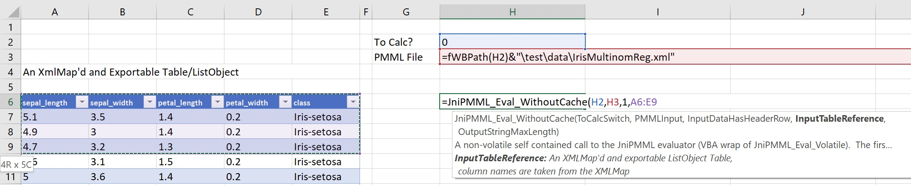
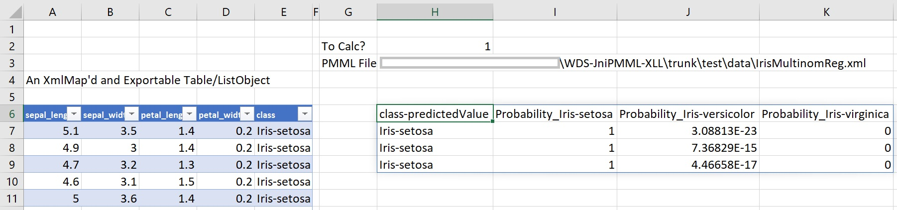
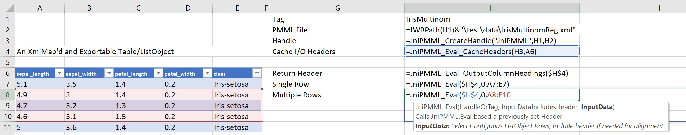
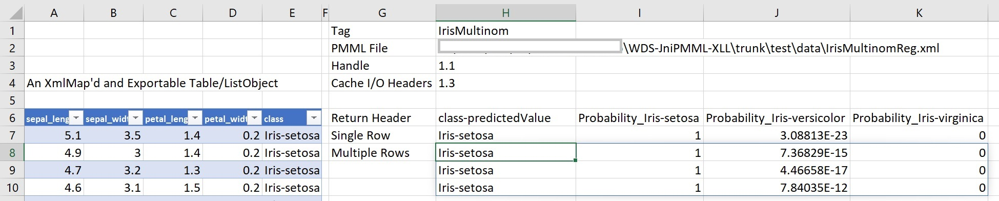

## Brief Intro

The primary objective of WDS-JniPMML-XLL is to provide model evaluators to Excel.  In particular, access to the standard PMML evaluators is
a starting point, both for use or for comparison.  Later versions will be include other model specs and implement other evaluators.

A quick easy way to evaluate PMML should be available to anyone, even those without access to the latest data science tools.   In the
finance industry, Excel is ubiquitous. To academic-type data scientists who might scoff at using Excel for anything, it is still a tool
which can be used smartly or extremely poorly (which can certainly be said of Python, R, Java, C#, or anything else).

## Simple Example

For one-time evaluations (less efficient, but simple), data is arranged in a table object. A macro is provided to assist in providing 
a technical requirement on the table.  The JniPMML\_Eval\_WithoutCache function takes just a few arguments as below:

In older versions of Excel, results could be returned as an array-valued function, but in Excel 2016, the <i>spill</i> feature allows
the function to return a dynamic number of rows and columns:

One thing that might not be obvious from the images above is these are function results.  The inputs may even be randomized and (relatively)
instantaneous evaluations returned.

## Slightly More Complex

More efficient model evaluation involves caching the model and then repeated calls to the evaluator without having to do all 
of the parsing process of the model implementation spec for every calculation.   There are several steps involved, but are simplified
in the workbook:
<ul>
<li>Pick a <i>Tag</i> for model</li>
If you are thinking this should be called a <i>Handle</i>, that would seem correct.  Except, the Handles are provided and controlled 
by the Java side and Tags are used on the Excel/C# side.

A Handle actually has two parts, <i>HandleMajor.HandleMinor</i>.  The HandleMajor is unique to the Tag and the cached model on the Java
side.  The HandleMinor increments with subsequant configuraton changes, such as caching the input schema from the ListObject and
the output schema.  Why do this?  It is an Excel-trick.  When other ranges depend on the HandleMajor.HandleMinor value of some cell,
and that cell recalculates, the correct cascade of recalculations occurs.

<li>Provide a PMML Model</li>
Here the model can be either a path to a PMML file or (more interestingly) a full PMML file as a string.  Why take the string?
One could build the file in the workbook.  Perhaps one is testing some transformation structure or just wants to see what happens.

<li>Create a handle</li>
Cache the PMML model on the Java side and return the new handle to Excel.

<li>Cache the input and output headers</li>
Based on the input XmlMap'd exportable table, update the HandleMinor.  This also internally caches the model outputs which can
be queried for column headings.
<i>Note: Some PMML models are harder to fully determine the output structures and results are returned as a dictionary-like structure.
In the current version and for this case, there is a function, JniPMML\_Expand\_ComplexValue that can be used to return an expansion.
See the WDS-JniPMML-XLL-Test.xlsm workbook for an example.</i>

<li>Point to input and return the evaluation</li>
The input is an XmlMap'd exportable table.  Before that raises any concerns, there is a macro available through the ribbon, 
"Add XmlMap to Selected ListObject", which will assign one to it through the following steps:
<ul>
<li>Select a cell in a table or the entire table</li>
<li>Hit the macro and you will be queried for one of the following</li>
<ul>
<li>Point to an external XSD file</li>
<li>Point to an XSD as a string in a cell</li>
<li>Infer one from the table</li>
<li>Use a cached PMML dictionary, matching by column name, and infer where a column is not in the dictionary</li>
</ul>
</ul>

The slightly more complex example:

With result:

See the provided Excel test workbook for additional examples.

